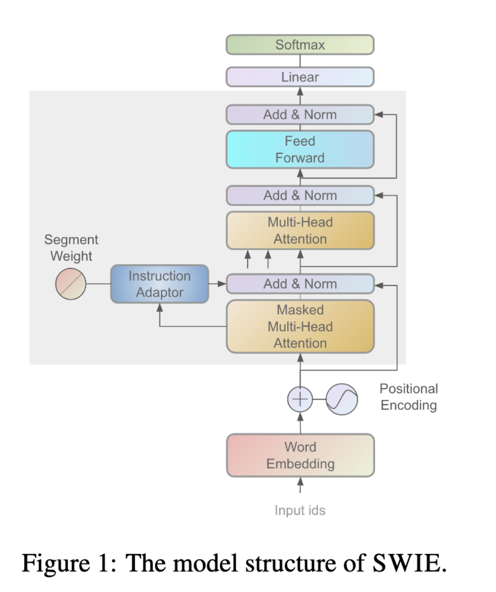
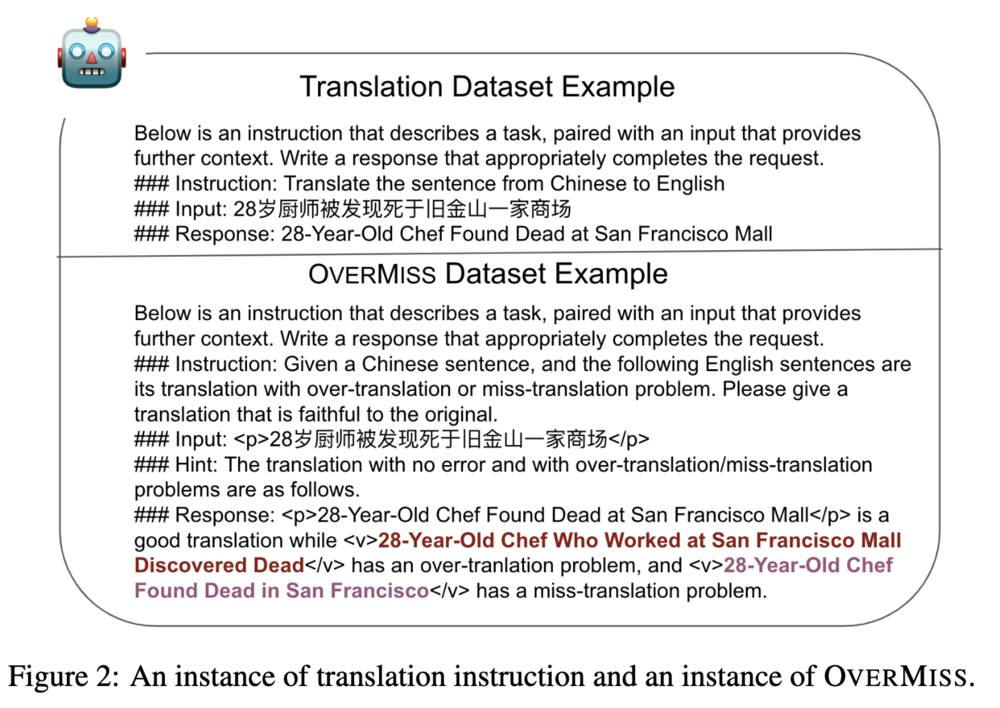
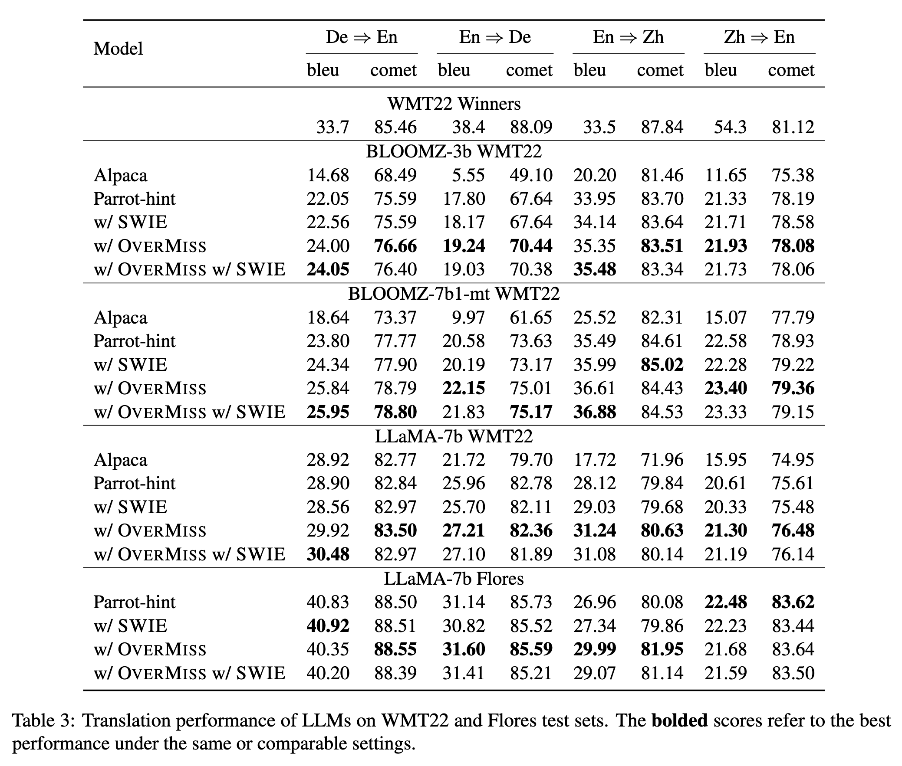

# Improving Translation Faithfulness of Large Language Models via Augmenting Instructions
## Overview
<!--#TODO: add the abstract part here and a overview figure, including model structure and data example.-->
We introduces a novel method named `SWIE` (**S**egment-**W**eighted **I**nstruction **E**mbedding), which utilizes parameterized adapters to encode instruction and introduces segmented weight to enable a natural integration of instruction representations and global representations. 
In order to further improve the model translation faithfulness, we present `OVERMISS` , an instruction dataset that utilizes our proposed framework to collect contrastive negative samples that specifically target over-translation and miss-translation issues. 
The [paper](https://arxiv.org/abs/2308.12674) has released in arxiv, please refer it for more details.
<div align="center">
    
    <p class="image-caption">Figure 1: The model structure of SWIE</p>
</div>

<div align="center">
    
    <p class="image-caption">Figure 2: An instance of translation instruction and an instance of OVERMISS</p>
</div>

## Environment

- python 3.8.3
- transformers 4.28.0.dev0
- deepspeed==0.8.3
- numpy==1.21
- torch==2.0.1+cu117
- accelerate==0.16.0
- datasets==2.9.0
- sentencepiece
- sacrebleu

## Dataset
### Training Data
Parrot-hint: open-source at https://github.com/wxjiao/ParroT

OverMiss: `train_data/overmiss_hf.json`
### Test Data
Flores: directory `test/Flores`

WMT22/WMT22-concat/WMT22-zero-shot : directory `test/WMT22`
## How to Use
### Train
- for LLaMA-7b: 
```bash
sh train_scripts/finetune_4gpu_llama.sh
```
- for BLOOMZ-3b: 
```bash
sh train_scripts/finetune_8gpu.sh
```
- for BLOOMZ-7b1-mt: 
```bash
sh train_scripts/finetune_4gpu.sh
```
### Inference
Run the following script to get model inference result.

```bash
sh infer_scripts/run_infer.sh
```
## Experiment
<!--#TODO: add the experiment result figure here.-->
The experiment results are show as the following table.
<div align="center">
    
</div>

## Citation
Please kindly cite us if you find the paper/code helpful.
```
@inproceedings{chen2023improving,
    title={Improving Translation Faithfulness of Large Language Models via Augmenting Instructions},
    author={Yijie Chen and Yijin Liu and Fandong Meng and Yufeng Chen and Jinan Xu and Jie Zhou},
    year={2023},
    eprint={2308.12674},
    archivePrefix={arXiv},
    primaryClass={cs.CL}
}
```